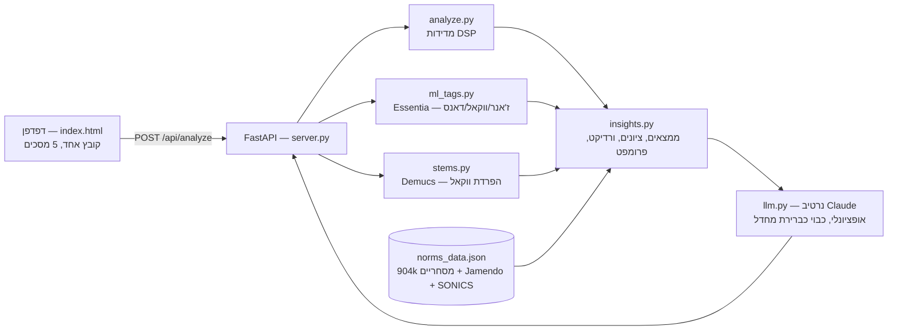

# A&R AI — המסמך המלא של המערכת

> **מה זה:** "המפיק המוזיקלי שלך מבוסס AI." מעלים שיר → מקבלים חוות דעת כנה בסגנון A&R — כמו דמו שנוחת על שולחן של לייבל. מדידות אמיתיות, תיקון אחד ברור, ופרומפט מדויק ל-Suno כדי לייצר גרסה טובה יותר.
>
> **הטאגליין:** "The producer between your generation and your release."

---

## 1. עקרון-העל: כנות. אף מספר לא מומצא — לעולם

זה לא סלוגן שיווקי — זה נאכף בארכיטקטורה:

- **כל מספר בדוח נמדד מהגל עצמו** (waveform). אין "פוטנציאל להיט", אין "סיכוי לפלייליסט בספוטיפיי", אין אחוזי הצלחה — כי אין להם ground truth, ואנחנו לא מזייפים.
- **מדרג הכנות ב-README:** 🟢 אמיתי ורץ (LUFS, true peak, דינמיקה, BPM, סולם, אינטרו, מאד, סטריאו) · 🟡 חלקי (סיגנלים של AI — כסיגנלים, לעולם לא כאחוז) · 🔴 **מוחרג בכוונה** ("commercial potential %", "will it chart").
- נורמות ז'אנר משמשות רק ל"כמה אתה רחוק ממה שבדרך כלל עובד" — לעולם לא "אתה תצליח".
- המרשם (prescription) **מסרב להציג כפתורים שהפלאגין לא באמת מכיל**.
- "Hear the fix" מדגים רק תיקונים שניתן לייצג ב-EQ — לא מעמיד פנים שהוא מדגים לאודנס/סטריאו/קומפרשן.
- מדריכי ה-walkthrough קיימים באנגלית ובעברית בלבד; שפות אחרות מקבלות את הצעדים באנגלית — עדיף כנה מאשר תרגום מכונה משובש.
- פאנלים בלי דאטה (איזון טונאלי, נורמות) פשוט **לא מוצגים** — במקום להמציא יעד.
- שכבה אופציונלית שנכשלה מדווחת **למה** (`deep_status`) — כי דילוג שקט נראה כמו פיצ'ר שבור ומפר את הבטחת הכנות.
- שורת הפוטר: "Every number in the report is measured — never invented."

**הלולאה שהמוצר בנוי סביבה:** ניתוח → תיקון אחד מתועדף → פרומפט לייצור מחדש ב-Suno/Udio → העלאת v2 → דלתאות מדודות (תוקן / השתפר / עדיין חלש) → חוזרים.

---

## 2. ארכיטקטורה במבט-על

- **תהליך FastAPI אחד** מגיש גם את ה-API וגם את הפרונט.
- פרונט: `web/index.html` — קובץ יחיד (~3,670 שורות), אפס תלויות-צד-ג'.
- מנוע: 5 מודולי Python (~2,350 שורות) + 5 מודלי TensorFlow.
- ניתוח רגיל ~13 שניות; מצב deep-vocal ~60 שניות. הכל CPU — אין GPU ואין עלות פר-קריאה (חוץ מה-LLM האופציונלי).

---

## 3. הפרונטאנד — כל מסך וכל פיצ'ר

### מעטפת גלובלית
- **הדר דביק**: לוגו VU-needle (מחוג שמזנק ב-hover; המותג לעולם לא מתהפך ב-RTL), תג beta, כפתור Sign in / אווטאר, בורר שפה, מתג תמה ◐ (כהה/בהיר, מצב פתיחה לפי העדפת המערכת, מרענן קנבסים בהחלפה).
- **שפת עיצוב "Studio Glass"**: zinc עמוק + ציאן, משטחי זכוכית, גרעון אנלוגי (grain), אפס אימוג'י, מוטיבים של ציוד אולפן — מחוג VU בדיאל הציון, כפתורי rotary בסגנון LA-2A בכל ממצא, מתג הארדוור, חלונות LED, ברגי faceplate.
- **נגישות ותנועה**: כיבוד `prefers-reduced-motion`, ARIA מלא (drop zone, כרטיסים, דיאלוגים), חשיפות בגלילה עם IntersectionObserver, כפתורים "מגנטיים", כוריאוגרפיית כותרת עם מסכות.
- **פוטר**: טאגליין + שורת הכנות; עמודת Product; עמודת Company — מודאלים של About / Privacy / Terms.
- **מטא/OG**: תגי og:image (1200×630), twitter card, canonical; `__ORIGIN__` מוזרק ע"י השרת מה-Host — אין דומיין צרוב בקוד.
- פונטים באחסון עצמי: SF Hebrew, SF Arabic, Didot, Frank Ruhl.

### מסך 1 — העלאה (`#s-upload`)
- כותרת גיבור: "Why doesn't my song feel **professional** yet?" + קנבס ספקטרום חי שמגיב לעכבר (ונעצר כשהטאב מוסתר).
- **גרירה ושחרור + browse**: \u200FMP3 / WAV / FLAC / M4A / AAC / OGG עד 100 MB; בדיקת גודל בצד לקוח **לפני** ההעלאה; ריבוי קבצים.
- "Pro move: drop 2–12 versions of the same song — we'll find the strongest" — קובץ אחד → דוח יחיד; כמה → מסך Batch.
- **צ'יפים של ז'אנר**: זיהוי אוטומטי + melodic techno, house, pop, hip-hop, edm, rock, lo-fi (נשמר ב-localStorage).
- **מתג Deep vocal analysis** — מתג חומרה עם ידית ולד; מעדכן את שורת האמון בין "~15 seconds" ל-"~1 minute in deep mode".
- **כפתור דמו** — "try it with a demo track" (הטראק "Nightdrive") עם אקולייזר מונפש.
- שורת אמון: פרטי — לעולם לא משותף · בלי חשבון · ~15 שניות.
- כרטיס "What you get" — תצוגה מקדימה של ורדיקט.
- **"Your desk" — היסטוריה**: עד 30 ניתוחים שמורים בדפדפן, אריחי LED עם שם/תאריך/מדדים, גרף sparkline של הציונים, פתיחה מחדש של דוח מלא בלחיצה, ניקוי בשתי הקשות. עמיד ל-QuotaExceeded (מוריד דוחות ישנים, שומר אריחים). דמו לא נכנס לדסק.

### מסך 2 — ניתוח (`#s-analyze`)
- **רסיטל טייפ ריל-טו-ריל** מסתובב (SVG מלא).
- 6 שלבי צ'קליסט מתוזמנים למשך האמיתי (רגיל/עמוק, עם ג'יטר) — השלב האחרון מסתובב עד שה-API באמת עונה.
- כשל רשת → ניסיון חוזר שקט אחד אחרי 1.5 שניות.

### מסך 3 — הדוח (`#s-report`) — המוצר עצמו
1. **כותרת טראק** + עטיפה עם כפתור נגינה + "New song".
2. **נגן מאוחד**: רצועת אנרגיה/מבנה שהיא גם משטח ה-seek — קליק מאזין מכל נקודה; tooltip עם זמן/אזור/אנרגיה; אזור אינטרו צבוע (ענבר רק כשהאינטרו באמת מסומן כבעיה); סמן "PEAK · m:ss" עם נקודה נושמת; אנימציית כניסה מדורגת.
3. **מסקנות מבנה** במשפטים מדודים: אינטרו תקין/קצר/ארוך (עם % מהשיר וטווח הז'אנר), פיק מאוחר (>85%) או פיק בתוך האינטרו, "N ירידות אנרגיה" או "שטוח".
4. **"Hear the fix"** — פריוויו EQ חי (Web Audio) של עד 3 תיקונים מהמרשם, עם המהלכים מודפסים ("−3 dB @ 235 Hz").
5. **כרטיס ורדיקט**: דיאל ציון SVG עם גרדיאנט וספירה עולה + פליטת מחוג VU; badge \u200F"A&R Verdict" (+" · AI" כשהנרטיב נכתב ע"י LLM).
6. **אריחי טלמטריה**: BPM · KEY · LUFS · TRUE PEAK · LENGTH, עם לד סטטוס המחובר לבדיקות הסטרימינג.
7. **"If you fix one thing"** — התיקון המתועדף האחד.
8. **באנר זיהוי גרסה**: "This looks like a new version of X from your desk" — לפי שם הקובץ (regex שתופס v2/final/master/mixdown/bounce…), שורד רענון.
9. **רצועת התקדמות פר-שיר** — ציר ציונים על כל הגרסאות של אותו שיר.
10. **ניווט דוח דביק**: You vs the genre / Tonal balance / Reference / The full read / AI / Streaming / Prompt — מסתיר סקשנים חסרים, הדגשת סקשן פעיל, כפתור Copy Prompt.
11. **אתה מול הז'אנר**: מטרים ל-BPM, LUFS ואינטרו מול "רצועת הלהיטים" (in the pocket / above / below) + קריאה בשפה פשוטה ("השיר שלך מתנגן 2.8 dB שקט יותר מהלהיטים סביבו") + שקיפות: "נמדד מול N שירים מסחריים".
12. **אתה מול רפרנס**: מעלים שיר גמור שאתה סומך עליו — עובר **את אותו מנוע בדיוק**; שורות דלתא ל-LUFS, true peak, דינמיקה, BPM, סולם, אינטרו, מאד, רוחב סטריאו, פאנץ', חפיפת קיק-בס; קנבס חפיפת עקומות אנרגיה; נשמר ומלווה אותך לשירים הבאים.
13. **איזון טונאלי**: עקומת 24 תדרים שלך מול רצועת הרבעונים (p25–p75) של משפחת הז'אנר, tooltip פר-תדר, מוצג רק כשקיימת עקומת corpus אמיתית.
14. **אקורדיון ממצאים** ממוין crit → warn → good; כל כרטיס: כפתור rotary עם מחט לפי הציון, ציון מספרי, headline, ובפתיחה — **Why** (סיבות), **מדידות** (אריחים), **צ'יפ "worst around m:ss–m:ss"** כשנמדדו קטעים, **How to fix it** (שורת DAW + שורת Suno).
15. **"Arsenal" — הפלאגינים שלך**: קלט חופשי עם fuzzy-match מול **בסיס ידע של 165 פלאגינים**, צ'יפים; פלאגין לא מוכר נשמר עם `?`; 5 חבילות מהירות (FabFilter·Ozone / Ableton / FL Studio / Logic Pro / Free plugins). סדר עדיפות: כלי ייעודי שבבעלותך → גנרי שבבעלותך → **המלצה חינמית עם הערה כנה** ("אין לך כלי לזה — בחירה חינמית: X").
16. **מרשם מיקס** פר-ממצא: פרמטרים מדויקים שנגזרים מהמדידה — eq_cut (בתדר המאד **האמיתי שנמדד**), limiter (gain = המרחק ל-LUFS היעד), clip, decompress, widen, sidechain (בתדר הבס שנמדד), transient, de-ess. התאמות פר-פלאגין ל-Kickstart/LFOTool/ShaperBox ול-Trackspacer.
17. **"Show me how"** — מדריכי צעד-אחר-צעד אמיתיים ל-**18 פלאגינים** (Pro-Q 3, EQ Eight, Parametric EQ 2, Channel EQ, TDR Nova, Pro-L 2, L2, Limiter No6, Fruity Limiter, Adaptive Limiter, קומפרסורים של Ableton/Logic, Pro-DS, DeEsser 2, BitterSweet, Drum Buss, Kickstart, Trackspacer) עם הפרמטרים מהמרשם מוזרקים לתוך הצעדים. אנגלית + עברית מלאות.
18. **סדר שרשרת** (Chain order) עם שמות הפלאגינים שנבחרו — רק כשיש 2+ מהלכים.
19. **פעולות האזנה** פר-ממצא דרך גרף Web Audio חי: "שמע איפה זה באמת מתחיל", "שמע את הרגע הכי חזק", **לולאה על הקטע הגרוע ביותר** שנמדד, "בודד את תדרי הבעיה" (bandpass על התדר שנמדד), "השווה במונו".
20. **פאנל "Does it sound AI-made?"**: סיגנלים בלבד — עם הסבר, מיקום באחוזון מול מוזיקה אנושית, ופרובננס.
21. **פאנל "Will it hold up on streaming?"**: בדיקות קשיחות — true peak, **בדיקת קודק אמיתית** (מקודד ל-AAC 256 ומודד מחדש!), קליפינג, אורך; גרף נרמול פר-פלטפורמה — Spotify \u200F−14, Apple \u200F−16, YouTube \u200F−14, Amazon \u200F−14, TIDAL \u200F−14, Deezer \u200F−15 — עם ניסוח מה יקרה בפועל ("turned down — normal" / "plays N dB quieter — they never boost quiet masters").
22. **באנר ביקורת ווקאל (live)**: קליק מפעיל deep mode ו**מריץ מחדש את אותו הקובץ במקום** אם הוא עדיין בזיכרון; אם הקריאה כבר רצה — אומר את זה במקום לשרוף עוד דקה.
23. **תיבת פרומפט**: צ'יפים Suno / Udio / Riffusion / Mureka / Other (Riffusion מקבל גרסה מקוצרת; רק Other מרשה name-drop של אמנים — Suno/Udio חוסמים שמות אמיתיים אז יש ניסוח descriptive-safe), כפתור Copy + טוסט.
24. **CTA לייצור מחדש**: "Now regenerate it in Suno." + העלאת גרסה חדשה + "just share this report instead".
25. **שיתוף**: (א) **קישור דוח** — הדוח כולו נדחס (deflate) לתוך ה-hash של ה-URL — **שום דבר לא נוגע בשרת**, הבטחת הפרטיות נשמרת גם בשיתוף; (ב) **כרטיס PNG \u200F1200×630** נרנדר בקנבס (מותג, ורדיקט, מיני-רצועת אנרגיה, צ'יפים) ויורד כקובץ — כולל שיקוף מלא ב-RTL.

### מסך 4 — Batch (`#s-batch`)
- שני מצבים אוטומטיים לפי שמות הקבצים: **אותו שיר → Version shoot-out**; **שירים שונים → A&R Demo Day** (דירוג).
- Shoot-out: 6 צירים מדודים (Overall, LUFS מול הנורמה, אינטרו, דינמיקה, סיגנלי AI, סטרימינג) — המוביל בכל ציר מואר, מנצח לפי צבירת צירים; "X leads on n of 6 measured axes" + הערה כנה: "זה מי שהכי חזק על הנייר — צירים מדודים בלבד, לא טעם. תן לשניים המובילים האזנה עיוורת."
- Demo Day: טבלת דירוג עם דגלים (סיגנלי AI, קליפינג, מאסטר שקט, או "clean") + "screening order, never a hit prediction".
- שורות התקדמות חיות פר-קובץ; כשל מדלג עם הודעה.

### מסך 5 — v2 (`#s-v2`)
- כותרת שמסתגלת לתוצאה **האמיתית**: "From 68 to 74 — real progress" / "Still at 71" / ניסוח ירידה — והתיבה מצהיבה כש-v2 חלשה יותר. כנות גם כשנסוגים.
- **מעקב מרשם**: כל בעיה מ-v1 מקבלת פסיקה — ✓ תוקן / ↑ השתפר-לא-גמור / ✗ עדיין חלש.
- כרטיסי דלתא פר-ממצא (ישן → חדש), Overall, ושורת סיגנלי AI ("lower is better").
- רצועת התקדמות, שיתוף + PNG.

### שפות (UI)
6 שפות בבורר: אנגלית, עברית, ספרדית, צרפתית, גרמנית, פורטוגזית. החלפת שפה על דוח פתוח **מנתחת מחדש** כדי שהמשפטים באמת יתורגמו. עברית = RTL מלא עם בידוד ערכים מספריים (dB/LUFS/BPM/Hz…) שנשארים LTR.

### Sign-in-lite
שם אמן ב-localStorage בלבד, אווטאר עם אות ראשונה, "continue as guest", יציאה. אין שרת, אין סיסמאות: "השם וההיסטוריה נשארים בדפדפן; האודיו מנותח ונמחק מיד."

---

## 4. מנוע הניתוח — כל מדידה (`engine/analyze.py`)

צנרת: אות מלא ללאודנס/פיק/סטריאו/טונאלי; כל הספקטרלי על downmix \u200F22,050 Hz; רשת ביטים וכרומה מחושבות פעם אחת; מעבר HPSS יחיד שמזין גם סולם (הרמוני) וגם טמפו (פרקוסיבי).

| מדידה | שיטה |
|---|---|
| **לאודנס משוקלל** | pyloudnorm — תקן **ITU-R BS.1770 / EBU R128** |
| **True peak** | \u200F4× oversampling לפי BS.1770 — תופס inter-sample peaks |
| **קליפינג** | \u200Ftrue peak ≥ \u200F−0.3 dBTP |
| **LRA** | טווח לאודנס בסגנון EBU R128 (בלוקים 3s, p95−p10) |
| **טווח דינמי** | RMS p95−p10 ב-dB |
| **בדיקת קודק** | **מריץ מקודד אמיתי**: ffmpeg → AAC 256kbps → פענוח → מדידת true peak מחדש |
| **טמפו** | tempogram על onset envelope פרקוסיבי + בחירת אוקטבה חכמה (t/2, t, 2t) לפי תמיכת beat+bar — נבחר בניסוי מבוקר: **66.7% / 78.9%** מול 40.5% / 52.3% בשיטה הישנה (n=664) |
| **סולם** | קורלציה מול 24 פרופילים על **כרומה הרמונית** (HPSS); פרופילי EDMM/EDMA מ-Essentia — נבחר בניסוי: **57.1% מדויק / 65.4 MIREX** מול 44.5/54.2 (n=604) |
| **ביטחון סולם** | **מכויל אמפירית** — לא תחושה: מרווח הקורלציה ממופה לאחוז פגיעה שנמדד; מתחת ל-0.55 הדוח **נוקב בסולם החלופי** במקום להתעקש |
| **אורך אינטרו** | זמן עד הגעת אנרגיה *מתמשכת* (חייבת להחזיק ≥2s) — אפקט בודד לא מסיים את האינטרו |
| **עקומת אנרגיה** | \u200F96 נקודות + `peak_moment_sec` |
| **מאד (low-mid)** | חלק האנרגיה ב-200–350 Hz + **תדר השיא האמיתי** (`mud_peak_hz`) שנכנס למרשם ה-EQ + **קטעי הזמן הגרועים** (`mud_spans`) |
| **רוחב סטריאו** | \u200F1 − קורלציית L/R; זיהוי מונו |
| **חפיפת קיק-בס** | \u200F40–120 Hz: זיהוי היטים של קיק ויחס אנרגיה בין-היטים/בזמן-היט + `bass_peak_hz` |
| **פאנץ' טרנזיינטים** | crest של onset envelope |
| **נוכחות ווקאל / סיבילנס** | \u200F2–5 kHz ו-5.5–9 kHz + קטעי זמן; *מפורש* רק כשה-ML או stem מאשרים ווקאל |
| **איזון טונאלי** | \u200F24 תדרים לוגריתמיים 30 Hz–16 kHz, בלתי-תלוי בעוצמה |
| **סיגנלי AI** | קשיחות תזמון, חזרתיות סקשנים, אחידות ספקטרלית — "SIGNALS, not proof" |

עמידות: שקט מוחלט לא מפיל את ה-API (LUFS ננעל ל-−70), קבצים קצרים/מונו לא קורסים.

---

## 5. לוגיקת הדוח (`engine/insights.py`)

- **13 קטגוריות ממצאים**: אינטרו, מאסטר, קליפינג, מיקס (מאד), דינמיקה, סטריאו, לואו-אנד, פאנץ', טונאלי, סיבילנס, ווקאל (deep), טמפו-וסולם, קרקטר (ML). לכל אחת נוסחת ציון מוגדרת מהמדידות.
- **Overall** = ממוצע כל הממצאים **חוץ מקרקטר** (מובטח בטסט — זיהוי ז'אנר לא מוריד ציון).
- **ורדיקט**: \u200F80+ "would survive a first listen at a label" / \u200F60+ "solid core" / אחרת "needs work" — + "החולשה הגדולה ביותר היא X".
- **זיהוי AI שמרן בקיצוניות**: מתוך 4 סיגנלים מועמדים, רק אחד (אחידות ספקטרלית) בכלל יורה — ורק אם השיר קיצוני יותר מ-90% מהמוזיקה האנושית שנמדדה. שלושת האחרים **הוצאו לגמלאות אחרי כיול** כי הם תופסים בני אדם. בקוד: "flagging a human artist as AI is the worst failure mode."
- **פרומפט Suno** נבנה מהממצאים בפועל, תמיד באנגלית (השפה שהפלטפורמות מבינות); גרסת brief ל-Riffusion; ניסוח descriptive-safe במקום שמות אמנים ב-Suno/Udio.
- **יעדי סטרימינג** מאומתים מול מפרטים שפורסמו (יולי 2026), עם ההערה הכנה: "אף כלי לא יכול להבטיח מה מפיץ יקבל."

---

## 6. \u200FML וניתוח ווקאל עמוק

### תיוג ML (\u200FEssentia, על המכונה — בלי API ובלי עלות)
- אמבדינג **Discogs-EffNet** שאומן על 3.3 מיליון רלסים; מעליו: **400 תתי-ז'אנרים** (top-3 + ביטחון), ווקאל/אינסטרומנטלי, danceability.
- מיפוי ז'אנר חכם ל-buckets של המוצר (Minimal/Techno/Trance → melodic techno וכו').
- **דגרדציה אלגנטית**: אין מודלים / חריגה → `{}` והדוח פשוט בלי ממצאי ML, לעולם לא קורס.
- **מקבילות אמיתית**: ה-ML רץ ב-ProcessPool חם במקביל ל-DSP — נמדד: \u200F3.66s במקום 4.58s.

### \u200FDeep vocal (\u200FDemucs)
- \u200Fhtdemucs בשני stems על **90 השניות הראשונות** (ffmpeg חותך לפני, כדי ש-Demucs לא יפענח סתם).
- **ראיית stem גוברת על המסווג**: ווקאל EDM מעובד יכול לקבל 0.43 במסווג — אז אם ה-stem המבודד שקט באמת, הדוח אומר את זה; אם יש שירה, מודדים אותה ישירות.
- מדידות ברמת stem (מעלות את ביטחון המרשם ל-high): סיבילנס ונוכחות על הווקאל המבודד, מאד על הליווי הנקי, **איזון ווקאל-מיקס** (רק בפריימים שבהם הווקאל באמת נוכח), **אינטונציה** ב-pyin (סטייה בסנטים מהחצי-טון הקרוב), **דינמיקת ביצוע**.
- **זיהוי אוטו-טיון**: סטייה ≤2¢ + \u200F98% בתוך ±10¢ → ממצא "autotune is doing all the work".
- `deep_status` תמיד מדווח: \u200Fran / no_vocals / unavailable / failed — מוצג כטוסט.

---

## 7. נרטיב LLM (אופציונלי)

- כבוי כברירת מחדל; מופעל עם `ANR_USE_LLM=1` + מפתח Anthropic. עלות ~$0.05 לדוח (Opus) / ~$0.02 (Sonnet).
- **חלוקת עבודה קשיחה**: \u200FDSP = מדידות; תבניות = ציונים/חומרות/תיקונים (דטרמיניסטי); \u200FLLM = ניסוח בלבד. **הסכמה המובנית לא מכילה שדות מספריים** — מספרים לעולם לא מגיעים מה-LLM.
- הנחיות מערכת: לעגן כל טענה במדידות, "לעולם אל תמציא עובדות על מלודיה/מילים/ווקאל — לא שמעת אותם", בלי הבטחות מסחריות.
- **כשל אף פעם לא שקט**: כל חריגה → נפילה חזרה לתבניות עם לוג; הדוח נושא `source: llm|template` וה-UI מוסיף " · AI" ל-badge רק כשבאמת נכתב ע"י LLM.

---

## 8. שפות (i18n)

- **דוח (שרת)**: 7 שפות — אנגלית, עברית, ספרדית, צרפתית, גרמנית, פורטוגזית, פורטוגזית-ברזיל. \u200F195 תבניות מחרוזת בכל שפה (מאומת זהה). נפילה חכמה לאנגלית.
- **UI (דפדפן)**: 6 שפות בבורר (בלי pt-BR).
- לא מתורגם בכוונה: פרומפט ה-Suno (אנגלית עובדת הכי טוב), תוויות יחידות (BPM/LUFS…).
- \u200FRTL מלא לעברית כולל שיקוף כרטיס ה-PNG.

---

## 9. דאטה ונורמות (`norms_data.json`)

| מקור | תוכן | היקף |
|---|---|---|
| **Zenodo 900k** (ספוטיפיי, CC BY 4.0) | נורמות להיטים: \u200FBPM p10–p90, \u200FLUFS p25–p75 פר-ז'אנר | \u200F904,000 שירים מסחריים (pop \u200F21,384 · hip-hop \u200F19,891 · rock \u200F18,208 · house \u200F3,584 · edm \u200F1,127 · lo-fi \u200F809 · melodic techno \u200F673 "להיטים") |
| **MTG-Jamendo + Jamendo API** | טווחי אינטרו (שירים באורך מלא!), עקומות טונאליות פר-משפחה, baseline אנושי מלא | \u200F~3,872 שירים עצמאיים מלאים |
| **FMA-small** | \u200Fbaseline אנושי (קליפים 30s, טרום-AI) | \u200F7,997 |
| **SONICS** | \u200Fbaseline של AI — שירים סינתטיים מלאים של Suno/Udio | \u200F10,000 |
| **GiantSteps Key** | ולידציית סולם | \u200F604 |
| **GiantSteps Tempo v2** | ולידציית טמפו | \u200F664 |

כל רשומה נושאת פרובננס: מקור, \u200Fn, תאריך ייצור — והדוח מציג אותם ("נמדד מול N שירים…").

---

## 10. \u200FAPI והשרת (`engine/server.py`)

| Endpoint | תפקיד |
|---|---|
| `GET /` | מגיש את הפרונט (+הזרקת origin לתגי OG) |
| `POST /api/analyze` | הראשי: \u200Ffile, genre (או auto), lang, deep, purpose (main/reference) |
| `GET /api/demo` | דוח הדמו "Nightdrive" \u200F(?lang=&v=1\|2) |
| `GET /api/genres` | רשימת ז'אנרים |
| `GET /api/health` | \u200Fok + זמינות ml/stems/llm — לניטור |
| `GET /og.png`, `GET /fonts/*` | נכסים סטטיים |

- **הגבלת קצב**: 20 ניתוחים / 15 דקות פר-IP (מספיק ל-shoot-out מלא); ה-IP נלקח מהערך **הימני ביותר** ב-X-Forwarded-For — בדיוק כדי שספופינג של ההדר לא יעקוף את המגבלה; המילון מפנה את עצמו מעל 10,000 רשומות.
- **CORS נכשל-סגור**: בלי `ANR_ALLOWED_ORIGINS` — אין גישה חוצת-דומיין בכלל.
- **טיפול בקבצים**: רשימת סיומות מותרת; 100 MB נדחה **לפני קריאת בייט** לפי content-length; הגוף מוזרם לקובץ זמני ב-chunks של 1 MiB (לעולם לא נטען ל-RAM); המרה עם ffmpeg תחת timeout; מחיקה מובטחת ב-finally.
- **דמו**: מדידות קבועות של v1 ו-v2 שעוברות **את אותו `build_insights()`** כמו קובץ אמיתי — הדמו מתורגם וכנה בדיוק כמו דוח אמיתי.
- ניתוח רץ ב-threadpool — האתר לא קופא בזמן שמנתחים.
- **זיהוי ז'אנר אוטומטי**: הניתוח רץ מול default במקביל ל-ML; כשהז'אנר מוכרע, הנורמות נבנות מחדש ולז'אנרים אלקטרוניים **הסולם נבחר מחדש** מהכרומה השמורה עם פרופיל EDMM — בחינם.

---

## 11. פרטיות ומגבלות

- **ההבטחה שפורסמה**: "האודיו מנותח ונמחק מיד. לא שומרים, לא משתפים, לא מאמנים עליו." — נאכפת בקוד (temp files בלבד) ומודגשת ב-DEPLOY.md כהבטחת מוצר.
- כל מה שאישי חי **רק בדפדפן** (localStorage): פרופיל, היסטוריה, רפרנס, ארסנל, העדפות.
- קישורי שיתוף נושאים את הדוח **בתוך ה-URL** — אפס מגע בשרת.
- מגבלות: \u200F100 MB, \u200F6 פורמטים, \u200F2–12 קבצים ב-batch, \u200F20 ניתוחים/15 דק', \u200Fdeep = \u200F90 שניות ראשונות, \u200F~13s ניתוח רגיל / ~60s עמוק.

---

## 12. כלים וצנרות (`tools/`)

- `ingest_zenodo.py` / `ingest_spotify.py` — נורמות להיטים.
- `ingest_jamendo.py` — קורפוס מלא (100 טארים, \u200Fsha256, ניתוח 240s, מחיקת אודיו).
- `ingest_jamendo_api.py` — הנתיב **החי**: \u200FJamendo API חינמי (35k בקשות/חודש), ניתן להרצה מתוזמנת כדי שהפרובננס יישאר טרי.
- `ingest_sonics.py` — \u200Fbaseline של AI מ-SONICS.
- `calibrate.py` — \u200FFMA.
- `validate_key.py` / `key_experiment.py` — ולידציה + ניסוי הסולם (כולל כיול הביטחון שרץ בפרודקשן).
- `validate_tempo.py` / `tempo_experiment.py` / `tempo_experiment2.py` — ולידציה + שני סבבי ניסוי הטמפו.
- `make_og.mjs` — רינדור כרטיס ה-OG בכרום headless, בלי תלויות.
- `mobile_test.mjs` — צילום מסך במובייל אמיתי (אמולציית CDP).
- `deploy_hf.sh` — דיפלוי בפקודה אחת ל-Hugging Face Space.

---

## 13. פריסה (Deployment)

- `run_prod.sh` — \u200Fuvicorn בלי reload; ברירת מחדל loopback (מאחורי nginx).
- **דרישות**: \u200F4+ GB RAM, \u200F2+ ליבות, \u200FPython 3.9+, \u200Fffmpeg.
- `Dockerfile` — \u200Fpython:3.9-slim + ffmpeg, משתמש uid-1000 (תואם HF Spaces), \u200Ftorch גרסת CPU בלבד (חוסך ~5 GB של CUDA), משקולות Demucs **אפויות באימג'** כדי שאף משתמש לא ישלם את עלות ההורדה הראשונה, פורט 7860.
- `DEPLOY.md` — מדריך מלא: \u200Fvenv, טסטים, prewarm, טבלת env, \u200Fsystemd, \u200Fnginx (כולל `client_max_body_size 100M`, \u200F`proxy_read_timeout 180s`, וההגדרה הקריטית של X-Forwarded-For שמונעת עקיפת rate-limit), \u200Fcertbot, ניטור עם `/api/health`.
- משתני סביבה: \u200F`ANR_ALLOWED_ORIGINS`, \u200F`ANR_RATE_MAX`, \u200F`ANR_RATE_WINDOW_SEC`, \u200F`ANR_USE_LLM`, \u200F`ANR_MODEL`, \u200F`ANTHROPIC_API_KEY`, \u200F`HOST/PORT/WORKERS`.

---

## 14. בדיקות ודיוק מפורסם

- **16 טסטים** (22 הרצות עם הפרמטריזציה על 7 שפות): דיוק מול ground truth מסונתז, עמידות (מונו/קצר/שקט), i18n מלא, נורמות, \u200FML, סריאליזציה, סטרימינג, stems, \u200FLLM (ממוקק — בלי רשת ובלי עלות).
- **מספרי הדיוק שאנחנו מפרסמים בעצמנו** (ב-About שבאפליקציה!):
  - סולם: **57% מדויק / 65.4 משוקלל-MIREX** \u200F(n=604) — ולכן הדוח מציג ביטחון מכויל ונוקב בסולם החלופי כשלא בטוח.
  - טמפו: **67% בתוך 4% / 79% עם סובלנות אוקטבה** \u200F(n=664).
  - לאודנס ופיקים: מדידות תקן ישירות, לא הערכות.
- שורת הסיום של ה-About: **"We never invent scores. If we can't measure something, it isn't in the report."**

---

## 15. פערים ידועים (כי גם המסמך הזה כנה)

- `mood_happy` — קובץ מודל קיים בריפו אבל **אף קוד לא טוען אותו**; אין תיוג mood כרגע.
- חלקים ב-README מיושנים מול הקוד: עדיין כתוב שזיהוי ז'אנר ו-ווקאל הם "phase 2" — בפועל שניהם חיים; תיאור זיהוי הסולם התעדכן בקוד אך לא שם.
- בורר השפות ב-UI לא כולל pt-BR למרות שהמנוע תומך בו במלואו.
- ה-About מציין 3,616 שירים עצמאיים; הדאטה כיום מסתכם ב-3,872 — צריך רענון של המספר.
- נורמות ה-Jamendo הן הנקודה הרכה של "אתה מול הז'אנר" — זה לא קטלוג הלהיטים המסחריים; חיזוק קבוצת הייחוס הוא המשימה החשובה ביותר בדאטה.

---

*נוצר: אוגוסט 2026 · מתוך סריקה מלאה של הקוד — כל עובדה במסמך נבדקה מול המקור.*
